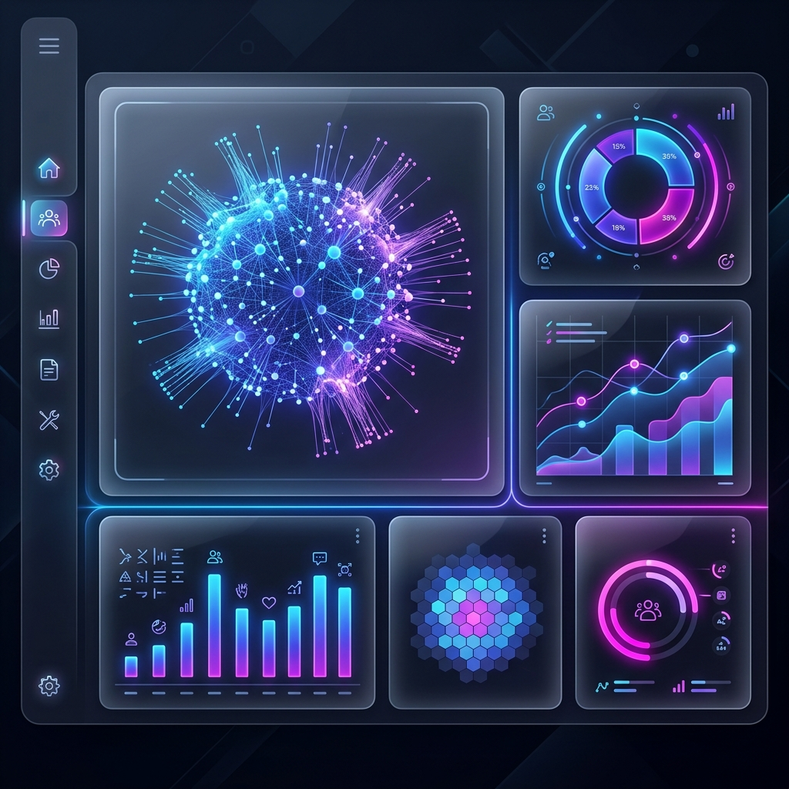

# AI Audience Builder 🧠📊



A high-rigor, chat-based audience builder for advertising campaigns. This project follows the "Principal Grade" engineering posture, utilizing a monorepo structure with NestJS, React, and Turborepo.

## 🚀 Features

- **AI Agent Chat**: Natural language interpretation of audience requirements using Gemini 1.5 Flash.
- **Taxonomy Mapping**: Automated mapping to Location and Transaction hierarchies.
- **Monorepo Architecture**: Shared types and optimized build pipelines via Turborepo.
- **Premium UI**: Dark-mode, glassmorphic design system built with Vanilla CSS.
- **Persistence**: SQLite database (via Prisma) for conversation history and user roles.

## 🛠️ Tech Stack

- **Frontend**: React, Vite, Lucide Icons, Vanilla CSS.
- **Backend**: NestJS, Prisma (SQLite), Google Gemini AI.
- **Orchestration**: Turborepo, pnpm workspaces.
- **Rigor**: Posture-Core implementation (Atomic change, Border validation).

## 📦 Setup & Installation

### Prerequisites

- Node.js >= 24
- pnpm >= 9
- Gemini API Key

### 1. Clone & Install

```bash
pnpm install
```

### 2. Environment Setup

Create `apps/backend/.env`:

```env
DATABASE_URL="file:./dev.db"
JWT_SECRET="your-secret"
GEMINI_API_KEY="your-key"
PORT=3000
```

### 3. Database Initialization

In the root:

```bash
pnpm db:deploy
```

### 4. Run Development

In the root:

```bash
pnpm dev
```

### 🐳 Run with Docker

If you prefer a containerized environment (from the root):

```bash
pnpm docker:build
```

This will start the backend on `localhost:3000` and the frontend on `localhost:80`.

## 📐 Design Decisions

1.  **Monorepo**: Chosen to ensure type safety across the stack. Shared interfaces in `packages/shared` prevent runtime mismatches.
2.  **SQLite**: Selected for the take-home task to ensure zero-config deployment and portability for evaluation.
3.  **Vanilla CSS**: Used for maximum flexibility and performance, demonstrating a custom design system without library bloat.
4.  **AI Prompting**: Implemented a "Context-Aware System Instruction" that injects the taxonomy directly into the LLM's short-term memory for high-precision signal mapping.

## 👥 Roles

- **Admin**: Full access to all builds and configurations.
- **Planner**: Access to chat and audience building.

---

❤️ Developed with Principal Rigor.
